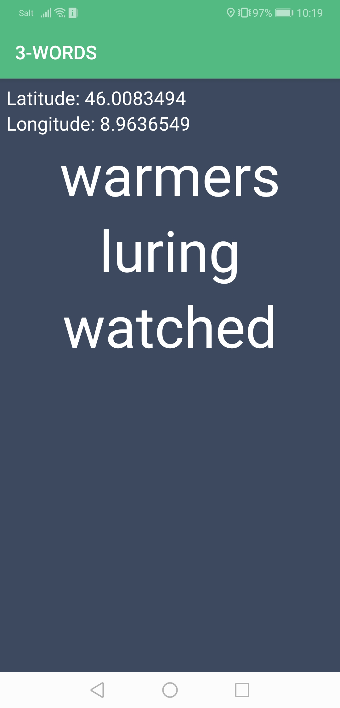

# words

A native application to experiment with [what3words](https://what3words.com/) API, built with NativeScript-Vue.     
Activate localization services on your mobile and move: the app will show and update what3words words corresponding to your current location.




## Usage

```bash
# Install dependencies
npm install

# Build for production
tns build <platform> --bundle

# Build, watch for changes and debug the application
tns debug <platform> --bundle

# Build, watch for changes and run the application
tns run <platform> --bundle
```